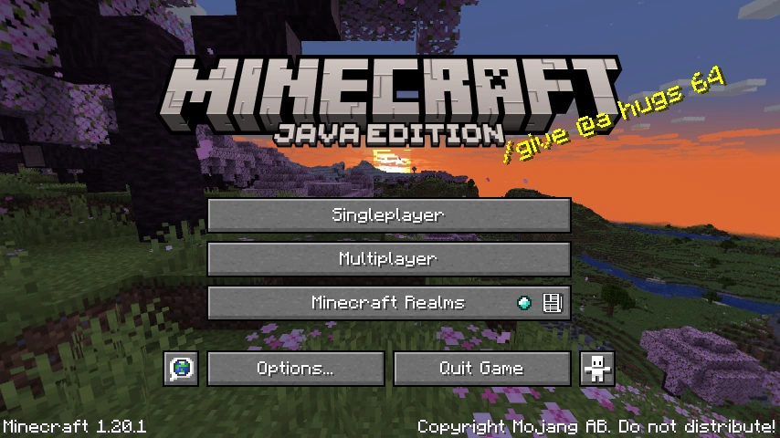
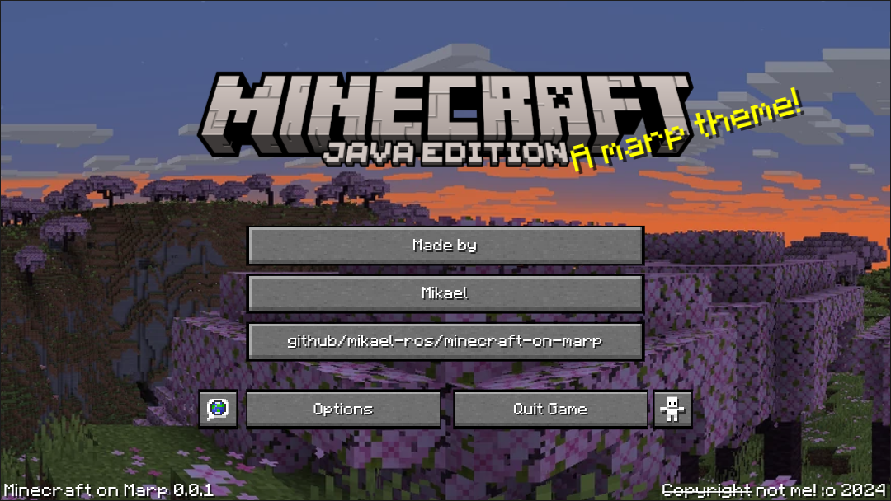
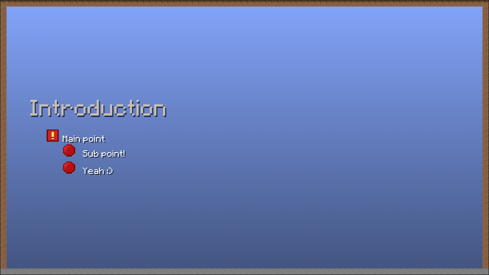
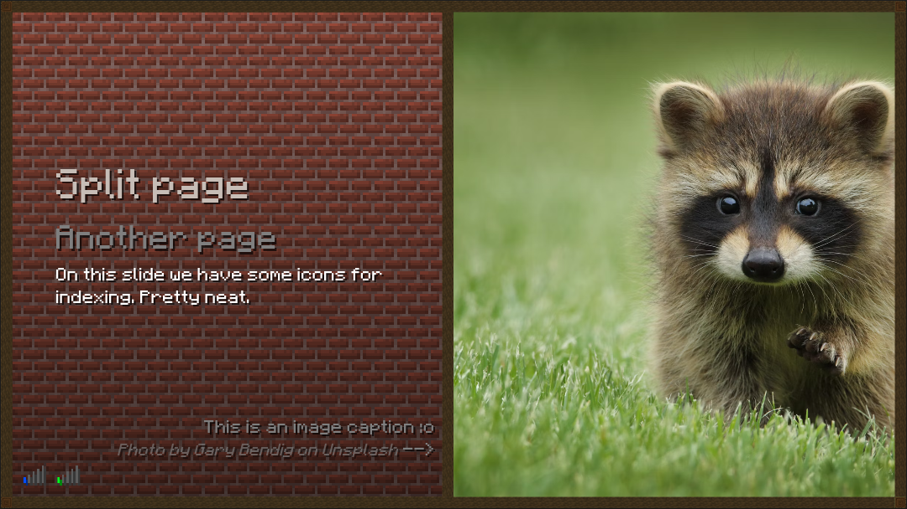

# Minecraft on Marp!
A yanky theme that uses Minecraft assets to create an accurate Minecraft experience.

[Marp](https://marp.app/) is a tool for creating presentations from Markdown. It's not very difficult to learn, and once you know the basics, it's a lot more performant, efficient and portable than PowerPoint. This project is in no way officially tied to or sponsored by Marp, but it is dependent on it's toolset.

Originally made for a Minecraft presentation I held in a networking course, where I measured the network usage of Minecraft. See [this repo](https://github.com/mikael-ros/wiresharkR) for some more tools I used to make graphs!

## Preview gallery
### Main menu


It's even got hover effects!




This is the real menu compared to mine.
### Other slides




Note the use of the pinging symbol as a page index.   While it looks best for 25 pages, you can expand it by adding more bars.
### Other resource packs
Resource packs can be replaced by just deleting the prior and importing a new one, see the following examples for how the look can be modified by doing this! Keep in mind borders will need to be regenerated after switching.


---

## How to use
> No guide is provided for Marp CLI. I assume anyone using it is knowledgable enough to do the proper steps themselves, though you can use part of this tutorial.

#### Prerequisites
##### Necessary
- [Visual Studio Code](https://code.visualstudio.com/) or [VSCodium](https://vscodium.com/)
- [Marp extension](https://marketplace.visualstudio.com/items?itemName=marp-team.marp-vscode)
- CSS and Markdown knowhow
##### Extra
- [WinRar](https://www.win-rar.com/) or other Zip tool (if using)
- [Git](https://git-scm.com/) and [basic git knowledge](https://git-scm.com/book/en/v2/Git-Basics-Getting-a-Git-Repository) (if using)
- [Minecraft](https://www.minecraft.net/en-us) installed, to extract textures (if using default)

### Common steps
1. Download this GitHub repository, either by downloading the latest ``release.zip`` or cloning. Delete the previews folder if you wish.
2. Download/extract the necessary third-party assets. See "Mining for assets"
3. Place them according to the patterns defined in the CSS file, unless you wish to change it:
  > assets/
  > -    fonts
  > -    texturepack <-- put textures here!
  > -    images

### Using the theme as an iteration zero
Follow the common steps. You won't need to do more :)

You can however, optionally, remove/change the .gitgnore to let you upload the exported textures. Please consult the proper terms of service of GitHub and the laws of your country as to wheter you can actually do this.

### Into existing project
> Note! this theme will likely not work very well together with others.

1. Follow the common steps, but put the files where you'd like them and make the necessary modifications to integrate it.
2. Modify your ``.vscode/settings.json`` to include the following:
```
  ...
  {
      "markdown.marp.themes": [
          ...
          "path/to/the-css-file.css"
          ...
      ]
  }
  ...
```

### Using a direct link to the .css file
> This option will make it more difficult to modify the style, and you're at the mercy of any updates I make in the future...

1. Follow the common steps, but don't download the repo, just get the assets and put them in the correct folders.
2. Modify your ``.vscode/settings.json`` to include the following:
```
  ...
  {
      ...
      "markdown.marp.themes": [
          "https://raw.githubusercontent.com/..."
      ]
      ...
  }
  ...
```

### Main menu
The main menu is created by declaring a section as a menu section. See the code snippet in [example.md](example/example.md) to see how you should implement it. You will need to modify the code accordingly if you don't want to use the same button layout.

The menu is implemented by forcing and choking list elements to behave like buttons. This is not only cruel, but extremely yank. Feel free to provide a better solution if you have one.

For credits sake, I have to mention that this menu was originally based on [this codesnippet](https://codepen.io/joexmdq/pen/EOMLzg) by [joexmdq](https://codepen.io/joexmdq), but has since been heavily modified (and updated to look like more recent versions of Minecraft).

---

## Mining for assets
### Font
By default, this theme uses Minecraftia for the font (which you can [find here](https://www.dafont.com/minecraftia.font)). [Minecraft Seven](https://fontstruct.com/fontstructions/show/2206218/minecraft-seven-classic) also works great.

### Resource/texture pack
This stylesheet sources almost all graphics from a resource pack.

To use the default resource pack, follow [this guide](https://mcreator.net/wiki/obtaining-minecraft-textures#:~:text=If%20you%20open%20the%20assets,edit%20to%20your%20heart's%20content.), which explains how to "mine" it out of the Minecraft client. Otherwise you can use any resource pack you like, just unzip it and drop it in the "assets/texturepack" folder. The way things are configured, any resource pack can act as a drop -in replacement, owing to the static nature of resource pack file structures.

### Borders
You'll have to make these yourself, but the process is fairly simple:
1. In your favorite design tool*, create a square canvas. The size of it is dictated by your needs, but a basic border would be 3 x <size of texture> px in both height and width.
2. Slap your textures in there, and tile them to fill the canvas. In GIMP you can do this with the paint bucket, using the image fill tool ([see this guide](https://docs.gimp.org/2.10/en/gimp-edit-fill-pattern.html))
3. Export it as png, and put it where you'd like. Preferably in "assets/borders". See examples for how to use.


### Panorama
The menu uses a stitched together set of screenshots, laid out like the way the game does it  ([see this wiki article](https://minecraft.fandom.com/wiki/Panorama)). This image is provided for you, since it's nothing more than some screenshots. If you wish to create your own, use my image as reference together with [this video](https://youtu.be/F7jMd3zsjZQ?si=m4q2S2cpjCGwVApC).


### Copyright
For obvious reasons, I won't provide or host these resources myself, since they're protected under copyright law. 

Similarly, **I would strongly advise you not to use this theme for a presentation from which you will monetarily gain** - unless you get written permission from both the font author AND Mojang or replace these assets with ones you have rights to use. 

As for my stylesheet, I grant you full permission to use it and modify it as you please, but I would be glad if you credited me :)

---

## Exporting and presenting
For the animations to work, it is crucial that you export in a format that supports them. I suggest HTML, but keep in mind that it will be less portable than, say, a PDF. 

When handing or sending things many people will want a PDF or PowerPoint file, so do make sure your presentation doesn't look odd in those formats!

A guide on how to export can be found in [Marp's extension documentation](https://marketplace.visualstudio.com/items?itemName=marp-team.marp-vscode).

If you need portability, one decent suggestion is using a free and static website host, like [Netlify](https://www.netlify.com/), so you can access the presentation without the dependencies. This is particularly preferable, since Netlify can integrate and be dynamically updated with GitHub repositories. You could, for example, fork this repo and bind it to your Netlify website. _(This project is NOT affiliated with or sponsored by Netlify, it's merely a suggestion)_
